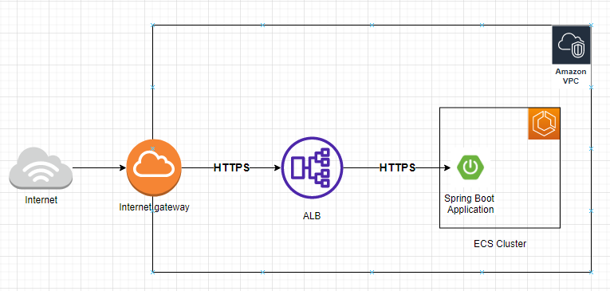

# Example of End to End encryption with Spring Boot and AWS ALB

This example uses encrypted connection all the way to your application using TLS.  This is a requirement for Zero-Trust Architecture(https://www.nist.gov/publications/zero-trust-architecture).  It enables encrypted traffic between the browser and AWS ALB and then again from AWS ALB to your Spring boot application running in ECS container.  The ALB offloads the first SSL/TLS certificate.  A a new TLS connection is created from ALB which then terminates into your Spring Boot application.

## Architecture

## Implementation Details
This example uses:
*  AWS ELB with SSL
* Uses the bcfips SpringBoot project and deploys to ECS. https://github.com/smislam/bcfips 
* Terminates SSL in Spring Boot
* Uses TLS certificate already stored in AWS ACM for ALB.  I do not show this step

## Steps to run
* Read more about end to end encryption:  https://docs.aws.amazon.com/AmazonECS/latest/bestpracticesguide/security-network.html

## Results
If all goes well, you should see this:

### Notes
* Oh, you will see the certificate is not trusted since I created a self-signed certificate for the ALB.  You may as well create a public Route53 domain and add a validated Cert to CertManager...