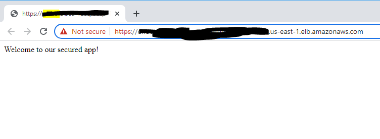

# Example of End to End encryption with Spring Boot and AWS ALB

This example uses:
*  AWS ELB with SSL
* Uses the bcfips SpringBoot project and deploys to ECS. https://github.com/smislam/bcfips 
* Terminates SSL in Spring Boot
* Uses TLS certificate already stored in AWS ACM for ALB.  I do not show this step

## Steps to run
* Read more about end to end encryption:  https://docs.aws.amazon.com/AmazonECS/latest/bestpracticesguide/security-network.html

## Results
If all goes well, you should see this:

* Oh, you will see the certtificate is not trusted since I created a self-signed certificate.  You may as well create a public Route53 domain and add a validated Cert to CertManager...